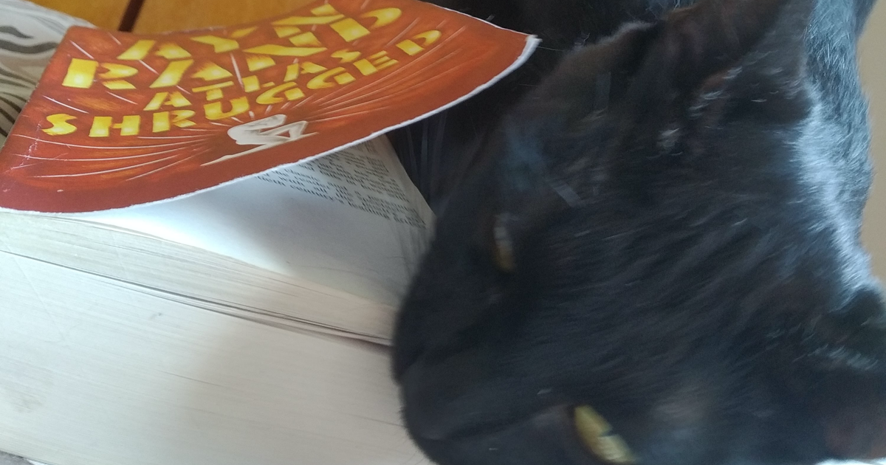

## How I Read: Atlas Shrugged

This post is the first in what I intend to be an ongoing series.

The inspiration to write these *"How I Read..."* posts comes from my disappointment in trying to find good content online about Ayn Rand's ***Atlas Shrugged*** – any channel or blog that tried to analyse it either praised it mindlessly from a pseudo-entrepreneurial perspective or dragged it in mud from the social standpoint.

My goal here is to present my own views of this book and of others I might find in the future. The idea is that an opinion in a book challenges my beliefs or puts me in a state of reflection, then the experience is too individual to be analysed by any person or institution that tries to reach some kind of mass audience.

With the disclaimer out of the way, here's ***How I Read Ayn Rand's "Atlas Shrugged"***:

>Erasmo showing his appreciation of literature

Lorem ipsum dolor sit amet, consectetur adipiscing elit. Etiam eu magna nec quam varius fermentum nec et tortor. Suspendisse aliquam eleifend lectus eget vulputate. Ut congue metus sit amet odio efficitur pellentesque et ac ante. Ut consectetur aliquet laoreet. Nam nisl felis, sollicitudin id luctus eu, faucibus vitae erat. Quisque posuere, orci sit amet sodales pretium, justo sapien sollicitudin metus, eget aliquam sapien magna ut lectus. Aenean nisl nulla, volutpat sit amet augue nec, venenatis dapibus augue. Sed a gravida massa, vitae fermentum nibh. Donec vitae mauris orci. Nunc rhoncus ex lacinia urna iaculis, efficitur convallis erat tempor. Vestibulum quis sapien sodales, ullamcorper mauris ut, dapibus arcu. Duis nunc urna, placerat eu est vel, imperdiet commodo eros. In iaculis dui non ante venenatis aliquam. Curabitur sem libero, interdum id maximus vitae, sodales eget augue. Donec dictum eget nunc eget porta.

Duis pellentesque dui lacus, id cursus lorem dapibus ac. Quisque ultricies lectus eu suscipit egestas. Vivamus sit amet tincidunt lectus. Integer pretium odio ut diam sagittis tincidunt. Cras convallis lectus a ante faucibus hendrerit. In tincidunt, dolor id cursus mattis, lorem metus fringilla metus, vel rhoncus felis ligula sit amet enim. In faucibus eros purus, vel ornare lectus venenatis a.

Praesent viverra rhoncus magna sed laoreet. Nam sit amet volutpat dolor. Donec eleifend velit vitae magna suscipit cursus. Suspendisse potenti. Etiam arcu enim, posuere eget eleifend sed, tristique sed est. Vivamus commodo id nunc quis euismod. Ut luctus ultricies luctus. Aenean eu leo varius, accumsan sem mattis, congue quam. Aenean nulla mauris, volutpat a maximus nec, dignissim a ligula.

Aliquam pharetra urna et dapibus ultrices. Aliquam eu tempor erat, vel eleifend purus. Sed purus libero, bibendum ut sodales non, volutpat sit amet sem. Nulla dictum consequat eleifend. Pellentesque placerat non nisl a tincidunt. Sed eget blandit elit. Maecenas non blandit felis. Proin ornare dictum leo, et convallis quam rhoncus nec. Duis imperdiet, quam eleifend imperdiet condimentum, nisl ligula fringilla orci, vel mattis mauris quam vitae massa. Pellentesque tincidunt metus tortor, non scelerisque justo tincidunt ac. In tincidunt ex ut sem tincidunt vehicula. Proin cursus tristique lacus, nec vulputate tortor maximus id.

Maecenas vitae semper tellus. Mauris quis hendrerit enim, sed ornare metus. Integer nec mauris id sapien pellentesque lacinia quis at odio. Sed at erat odio. Morbi nec lorem vitae ex pellentesque ornare. Etiam rutrum nisi non nulla dictum euismod. Morbi dui dui, hendrerit et facilisis sit amet, posuere sit amet magna. Vestibulum consectetur maximus lacus nec placerat. Curabitur vel volutpat nisi.